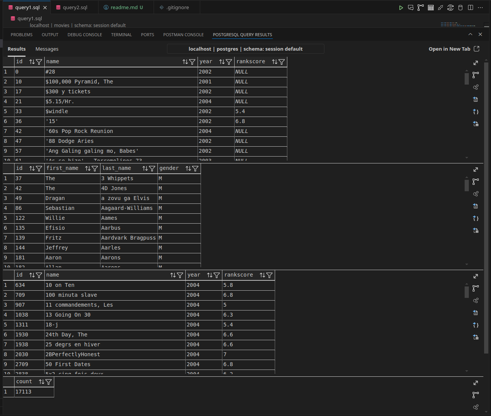
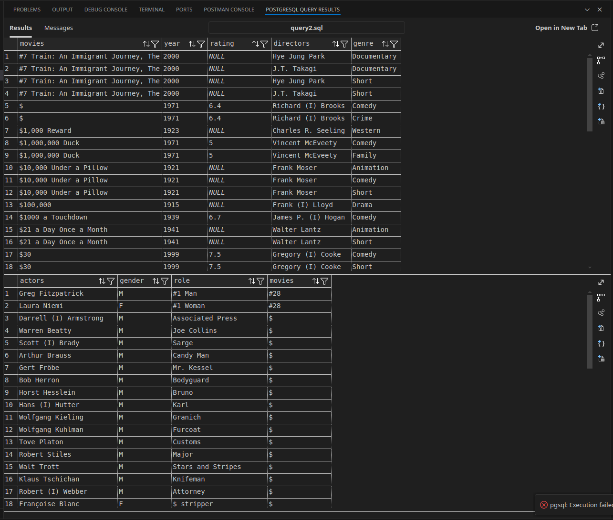
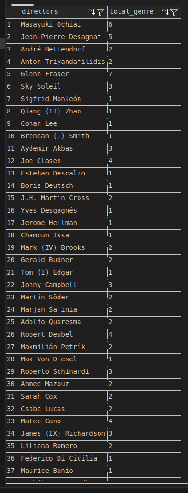
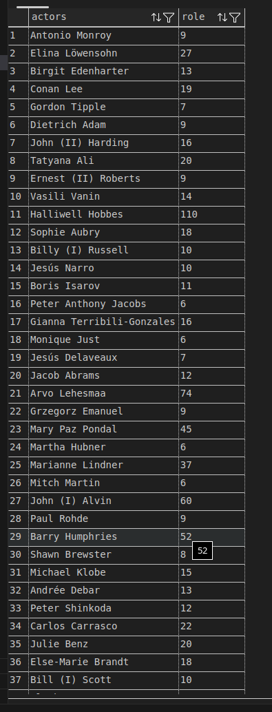
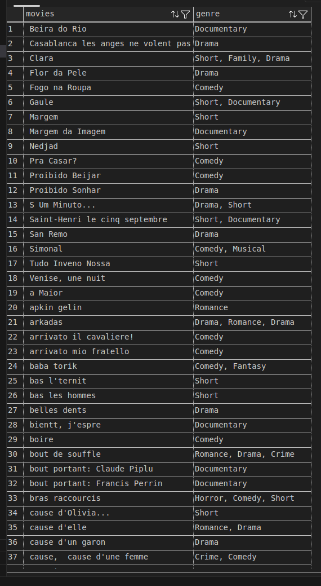
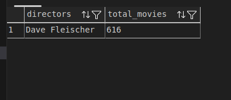
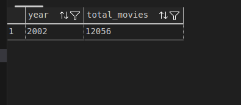

# SQL Query postgreSQL Mengambil data

## Ini merupakan penjelasan query sql untuk mengambil data sesuai kriteria dan ambil data degan relasi tabel lain dengan JOIN

### Screenshoot Query1


pada query ini merupakan memfilter pengambilan data dengan kondisi tertentu pada satu atau lebih kolom pada tabel, seperti WHERE, LIKE, BETWEEN. serta yang terakhir adalah Menghitung jumlah rows sesuai kondisi dalam tabel dengan Menggunakan perintah COUNT. 

### Screenshoot Query2


pada query ini menampilkan data antar tabel yang berelasi dengan menggunakan join. dimana untuk menyingkat penamaan tabel kita bisa aliaskan dengan menambahkan spasi setelah nama tabel lalu nama alias. contoh:
```sql
FROM "actors" "a"
JOIN "roles" "r"
```

lalu untuk penamaan coloumn tabel yang ambigu kita bisa aliaskan nama tabelnya setelah kita panggil pada select, seperti contoh :
```sql
"m"."name" AS
```
lalu karna pada tabel nama director dan actor menggunakan first name dan lastname, kita bisa gabungkan 2 coloumn tersebut kedalam satu coloumn dengan cara 
```sql
concat_ws( ' ',"a"."first_name", "a"."last_name") AS "actors"
```

### Screenshoot Query3

<table>
    <tr>
        <td>Data Director dengan Jumlah Genre</td>
        <td>Data Actor dengan Role > 5</td>
        <td>Movies dengan genres dibuatkan 1 coloumn dipisah comma</td>
    </tr>
    <tr>
        <td></td>
        <td></td>
        <td></td>
    </tr>
</table>

<table>
    <tr>
        <td>Data director paling produktif</td>
        <td>Tahun tersibuk dengan jumlah moviesnya</td>
    </tr>
    <tr>
        <td></td>
        <td></td>
    </tr>
</table>
